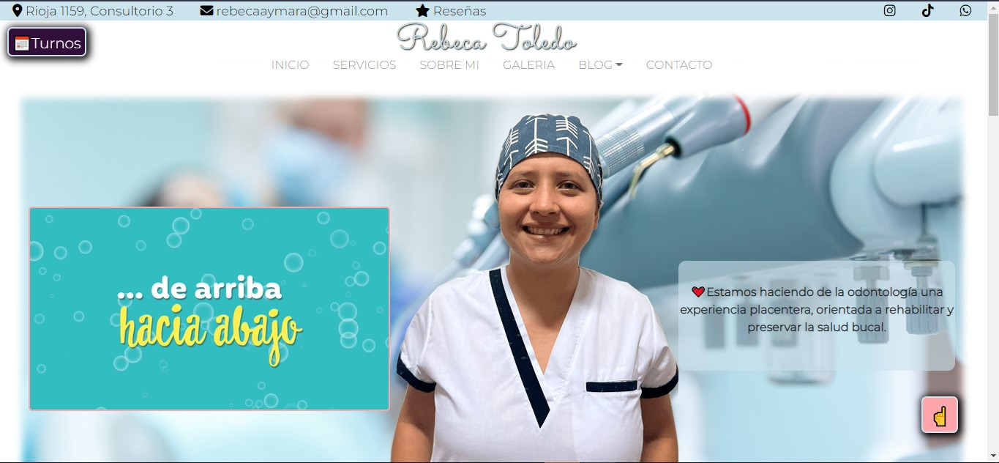

<!-- PROJECT LOGO -->
 
  <h3 align="center">Rebeca Toledo - Odontologa</h3>

  

    First Web Page I'm doing for a dentist in my city.
  

<!-- TABLE OF CONTENTS -->

  
Table of Contents

  <ol>
    <li>
      <a href="#about-the-project">About The Project</a>
      <ul>
        <li><a href="#built-with">Built With</a></li>
      </ul>
    </li>
    <li><a href="#contributing">Contributing</a></li>
    <li><a href="#contact">Contact</a></li>
    <li><a href="#acknowledgments">Acknowledgments</a></li>
  </ol>

<!-- ABOUT THE PROJECT -->
## About The Project

This is my first project I'm doing full vanilla with HTML, SCSS, BOOSTRAP. 

Context:
I started a full-stack learning path and this is my first page I'm doing with the "web design" course.
I decided to make the project for my Sister because she needed a webpage for his job and also It would be good for her having one to improve her "digital" presence.

(<a href="#top">back to top</a>)

### Built With

BOOTSTRAP
HTML
SASS

(<a href="#top">back to top</a>)

<!-- CONTRIBUTING -->
## Contributing

Contributions are what make the open source community such an amazing place to learn, inspire, and create. Any contributions you make are **greatly appreciated**.

If you have a suggestion that would make this better, please fork the repo and create a pull request. You can also simply open an issue with the tag "enhancement".
Don't forget to give the project a star! Thanks again!

1. Fork the Project
2. Create your Feature Branch (`git checkout -b feature/AmazingFeature`)
3. Commit your Changes (`git commit -m 'Add some AmazingFeature'`)
4. Push to the Branch (`git push origin feature/AmazingFeature`)
5. Open a Pull Request

(<a href="#top">back to top</a>)

<!-- CONTACT -->
## Contact

- GitHub - [Felix Toledo](https://github.com/felix-toledo)
- Frontend Mentor - [@felix-toledo](https://www.frontendmentor.io/profile/felix-toledo)
- Twitter - [@_felixtoledo](https://www.twitter.com/_felixtoledo)
- Mail: felixtoledoctes@gmail.com

Project Link:
- REPO URL: [Repo](https://github.com/felix-toledo/rebecaToledoOdontologa)
- Live Site URL: [Live](https://rebetoledo.com)

(<a href="#top">back to top</a>)

<!-- ACKNOWLEDGMENTS -->
## Acknowledgments

Use this space to list resources you find helpful and would like to give credit to. I've included a few of my favorites to kick things off!

Since I was learning at the same time I was doing the page, I found helpful a lot of pages to learn but the best were:

* [GitHub Pages](https://pages.github.com)
* [Font Awesome](https://fontawesome.com)
* [W3 School](https://www.w3schools.com/)
* [Free Code Camp](https://www.freecodecamp.org/)
* [Couderhouse](https://www.coderhouse.com/)

(<a href="#top">back to top</a>)

